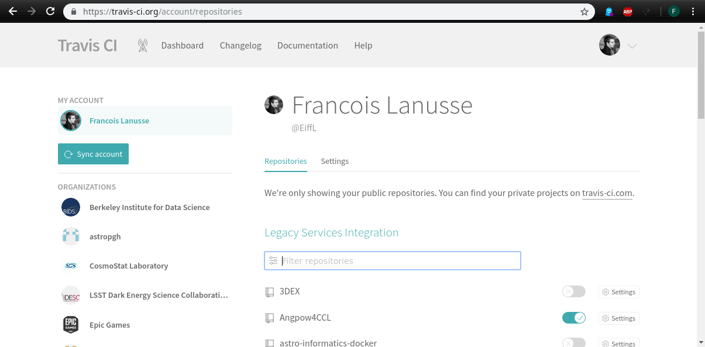
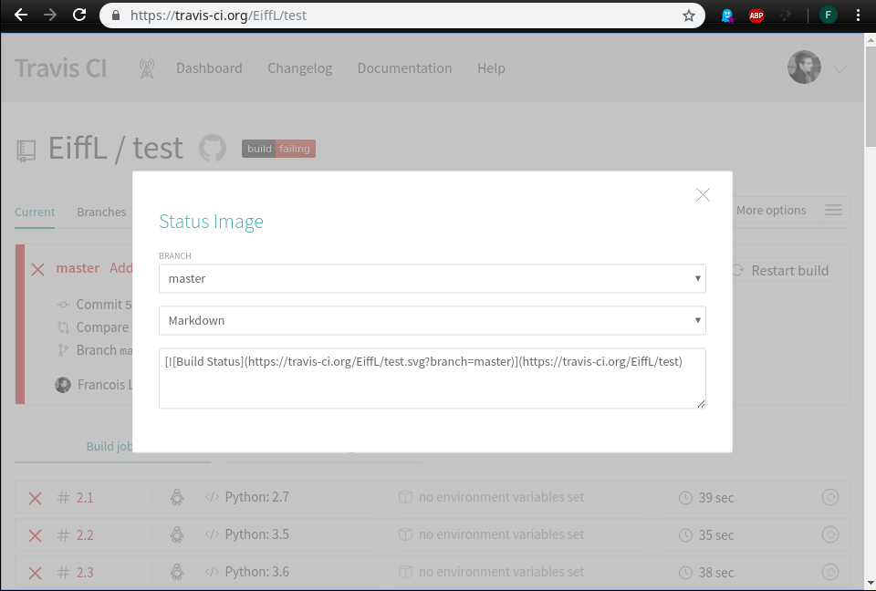
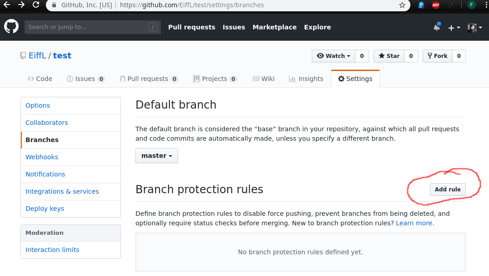

---
# To use reveal-md, first install it using npm:
# $ npm install -g reveal-md
# Then run it, pointing to this slide deck:
# $ reveal-md slides.md
title: Collaborative software development in Python
theme: simple
highlightTheme: monokai
---

## Collaborative software development in Python

DE School, Berkeley 2019

---

## Before we begin

----

### Setting up your environment locally

Download the material and setup your environment:
```bash
$ git clone https://github.com/LSSTDESC/Berkeley2019SWE.git
$ cd Berkeley2019SWE
$ pip install --user -r requirements.txt
```

To check your setup:
```bash
$ python check_setup.py
```

----

### Setting up your environment at NERSC

Go to [https://jupyter-dev.nersc.gov](https://jupyter-dev.nersc.gov) and open a new terminal:

  


----

Downloading tutorial material:
```bash
$ git clone https://github.com/LSSTDESC/Berkeley2019SWE.git
$ cd Berkeley2019SWE
```

Setting up a virtual environment
```bash
$ module load python3
$ python3 -m venv tutorial-env
$ source tutorial-env/bin/activate
$ pip install -r requirements.txt
```

checking your setup:
```bash
(tutorial-env) flanusse@cori19:Berkeley2019SWE> python check_setup.py
[ok] numpy         1.16.1
[ok] scipy         1.2.1
[ok] matplotlib    3.0.2
[ok] notebook      5.7.4
[ok] pytest        4.3.0
```

---

## Continuous Integration

---

### What is CI?

  - Allows you to automatically run your test suite at each commit

  - Can automate tasks like documentation building, binary distribution

  - Multiple solutions on the market
    - [Travis CI](https://travis-ci.org/)
    - [Circle CI](https://circleci.com/)
    - [GitLab](https://docs.gitlab.com/ee/ci/) or [Jenkins](https://jenkins.io/)

---

To see an example of CI in action, checkout https://travis-ci.org/LSSTDESC/CCL


[](https://travis-ci.org/LSSTDESC/CCL)

---

## Setting up Travis CI for our project

---

First step is adding a *.travis.yml* script to the root of your project:

```yaml
language: python
python:
  - "2.7"
  - "3.5"
  - "3.6"

# command to install dependencies
install:
  - pip install -r requirements.txt

# command to run tests
script:
  - pytest
```
more info here: https://docs.travis-ci.com/user/tutorial/

----

  - Go to https://travis-ci.org/ and sign-in with your GitHub account

----


  - Enable build for specific repository by browsing: https://travis-ci.org/account/repositories


  

----

   - Add a badge [](https://travis-ci.org/EiffL/test) to your project README.md
  


---
Back on GitHub

---

   - Enable branch protection by going into [`settings/Branches`](https://github.com/EiffL/test/settings/branches):

  


----

Let's check out an example: https://github.com/LSSTDESC/CCL/pull/442

---

### [Read the docs](https://readthedocs.org)

---

[Read the docs](https://readthedocs.org) allows you to automatically build and host your
project documentation online.

  - Online documenation is always up to date, you don't even have to think about it

----

  - Login to read the docs with your GitHub account: https://readthedocs.org/accounts/signup/

  - Import a new project from your dashboard: https://readthedocs.org/dashboard/

---

And now you have automated tests and online documentation hosting.

Congratulations
