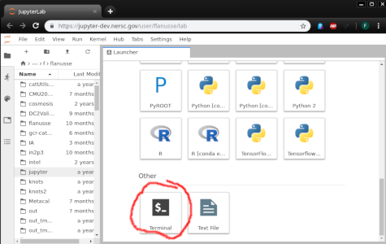

---
# To use reveal-md, first install it using npm:
# $ npm install -g reveal-md
# Then run it, pointing to this slide deck:
# $ reveal-md slides.md
title: Collaborative software development in Python
theme: simple
highlightTheme: github
---

## Collaborative software development in Python

DE School, Berkeley 2019

---

## Before we begin

----

### Setting up your environment locally

Download the material and setup your environment:
```bash
$ git clone https://github.com/LSSTDESC/Berkeley2019SWE.git
$ cd Berkeley2019SWE
$ pip install --user -r requirements.txt
```

To check your setup:
```bash
$ python check_setup.py
```

----

### Setting up your environment at NERSC

Go to [https://jupyter-dev.nersc.gov](https://jupyter-dev.nersc.gov) and open a new terminal:

  


----

Downloading tutorial material:
```bash
$ git clone https://github.com/LSSTDESC/Berkeley2019SWE.git
$ cd Berkeley2019SWE
```

Setting up a virtual environment
```bash
$ module load python3
$ python3 -m venv tutorial-env
$ source tutorial-env/bin/activate
$ pip install -r requirements.txt
```

checking your setup:
```bash
(tutorial-env) flanusse@cori19:Berkeley2019SWE> python check_setup.py
[ok] numpy         1.16.1
[ok] scipy         1.2.1
[ok] matplotlib    3.0.2
[ok] notebook      5.7.4
[ok] pytest        4.3.0
```

---

## Setting up Travis CI

---

The *.travis.yml* script:

```yaml
language: python
python:
  - "2.7"
  - "3.5"
  - "3.6"

# command to install dependencies
install:
  - pip install -r requirements.txt

# command to run tests
script:
  - pytest
```

---

### Documentation

Check out this [link](https://numpydoc.readthedocs.io/en/latest/format.html)


Note: speaker notes FTW!
